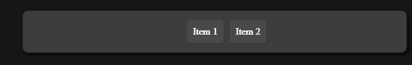

# Navbar Documentation

This part of the documentation will show you how to use the built in 
top navbar of ChocolateCSS.

# Flyout navbar

<div align="center">
    
</div>

---
The flyout navbar is a modern navbar design. 

```html
    <!-- Navbar base -->
    <div class="flyout-navbar navbar-grey">

        <!-- Nav toggler for mobile design -->
        <button class="navbar-toggler"></button>

        <!-- List of items -->
        <ul>
            <li>Item 1</li>
            <li>Item 2</li>
        </ul>
    </div>
```

The outer `div` requires at least two classes. The first one is the `flyout-navbar` class. It defines the type of the navbar.<br>

Furthermore you need a theme for the navbar. There are three:

- `navbar-light`
- `navbar-grey`
- `navbar-dark`

They are defining the look of the navbar. Try them out yourself.


## Nav toggler

---

If you want to have an responsive navbar, you obviously need some type of navbar extender. 
 
```html
<button class="navbar-toggler"></button>
```

The `navbar-toggler` defines the design and functionallity of the navbar toggler.
<br>
<strong>NOTE:</strong> You need too use the latest `navbar-toggler.js` script. It`s usage is descriped in the <a href="./scripts.md">scripts documentation</a>.

## Nav items

---

```html
<ul>
    <li>Item 1</li>
    <li>Item 2</li>
</ul>
```
The `ul` tag contains all nav items. The nav items are made with an `li`  tag. Inside you can put everything you want.

<strong>NOTE:</strong> You may use some of your own css to make your nav content fit correctly. The `li` tag is only optimized for texts.


## Different sizes

---

You can use different nav sizes.

- `navbar-full`
- `navbar-half`
- `navbar-60`
- `navbar-small`
- `navbar-shown`

You can play arround with them youself!
