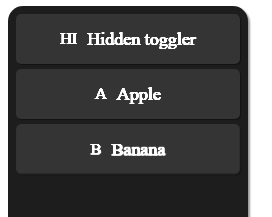

# Sidebar documentation

This part of the documentation will show you how to how to 
use the built in Sidebar of ChocolateCSS.

<div align="center">
    
<hr>
</div>


# Basics

To use the sidebar of ChocolateCSS is quite easy.

```html
<div class="sidebar sidebar-dark">
        
        <div class="sidebar-item sidebar-toggler">
            HI
            <div class="hidden-content">Hidden toggler</div>
        </div>

        <div class="sidebar-item">
            A
            <div class="hidden-content">Apple</div>
        </div>
    </div>
```

The `sidebar` class defines the sidebar. The extra class `sidebar-dark` defines its theme. There are three available themes.

- `sidebar-light`
- `sidebar-grey`
- `sidebar-dark`

Into the body of the div, you can put your sidebar content.

An sidebar item requires the class `sidebar-item`. 


# Extended content

If you are allowing to extend your sidebar, you can add more content like a text to it, which will only be displayed, if the sidebar is extended.<br>

It is quite easy to implement.

Just put a `div` with the class `hidden-content` into your `sidebar-item`.
Into this div you can put your content, which will be displayed, if the navbar is extended.


Example:
```html
<div class="sidebar-item">
    B
    <div class="hidden-content">Banana</div>
</div>
```


# Sidebar extender

If you are using extended content, you are going to use an sidebar toggler button.

It is quite easy to implement.

It is like an default sidebar item, but wiith the extra class `sidebar-toggler`. 

```html
<div class="sidebar-item sidebar-toggler">
    TG
    <div class="hidden-content">Hidden toggler</div>
</div>
```

If you click it, the sidebar will extend. If you click it again, it will shrink to it start size.

<strong>NOTE:</strong> You will need to add the `sidebar-toggler.js` script. It`s usage is descriped in the <a href="./scripts.md">scripts documentation</a>. 
