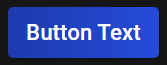
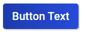

# Button documentation

This part of the documentation will show you, how to use<br>
the buttons of ChocolateCSS.

### Buttons and colors

To use buttons with ChocolateCSS is quite easy.

```html
<button class="btn-blue">Button Text</button>
```

The final result will look like this:
<div align="center"></div>

`btn-` is the base of the button classes. If you want to use other colors then blue, you need to change `blue` to another
color. For example: `btn-red`.

Supported colors:
- blue
- red
- green
- purple
- pink

### Button sizes

Furthermore you can change the size of the different buttons with the extra size classes.
```html
<button class="btn-blue btn-lg">Button Text</button>
```

The extra class `btn-lg` will increase the size of the button.
You can also use `btn-sm` to reduce the size.
The default value of the button is `btn-md`.


### Button shadows

If the `box-shadow` if the button does not match your taste,
you can also change it.

```html
<button class="btn-blue btn-shadow-lg">Button Text</button>
```

The extra class `btn-shadow-lg` increases the shadow.
You can also use `btn-shadow-md` and `btn-shadow-sm`.
Default value is `btn-shadow-sm`.

<div align="center">
    
    
</div>

The left button shows the default shadow. The right one contains the extra class `btn-shadow-lg`.

